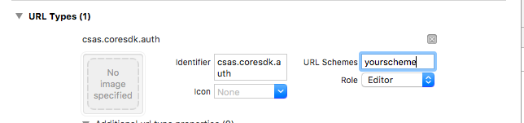

# Locker

Locker simplifies authentication against CSAS servers. It allows developer to obtain access token for the user and store it in a secure manner.

## Fetures

- [x] **Registration** - Obtaining access token from oAuth2 serves for the user and securing it by password.
- [x] **Unlock (Login)** - Obtaining access token after registration in exchange for the password.
- [x] **Lock (Logout)** - Securing the access token when the app is not in use
- [x] **Unregister** - Purging the access token from the device
- [x] **Change password** - Change the password that secures the access token
- [x] **Token Refresh** - Refreshes the access token
- [x] **OneTimePassword** - Obtaining the access token without user intervention (Work in Progress)

## Configuring locker

You need to configure the locker before you can use it.

You can configure locker by calling `.useLocker()` on the CoreSDK. Example configuration is below:

```swift
func application(application: UIApplication, didFinishLaunchingWithOptions launchOptions: [NSObject: AnyObject]?) -> Bool {
        CoreSDK.sharedInstance
            .useWebApiKey("YourApiKey")
            .useEnvironment(Environment.Sandbox)
            .useLocker(
                clientId: "YourClientID",
                clientSecret: "YourClientSecret",
                publicKey: "YourPublicKey",
                redirectUrlPath: "yourscheme://your-path",
                scope: "/v1/netbanking")

         return true
    }
```

### Configuration parameters

- `clientId` - ID of your application assigned by WebApi
- `clientSecret` - Client secret provided to you by WebApi
- `publicKey` - Public key used to encrypt the session key between you and the Locker server. **IMPORTANT**: Be sure to copy it exactly from the WebApi console as-is. Pay special attention to not include any spaces or carriage returns in the string.
- `redirectUrlPath` - oAuth2 redirection url that your application has to be registered to handle. **IMPORTANT**: You have to register your URL scheme with the APP.
- `scope` - Scope for the retrieved access token. If in doubt, use `/v1/netbanking`

### OAuth redireciton handling

In order to successfully handle redirections from the Web browser to your app during the Locker registration, you have to configure your app to properly handle it.

1. Add the url scheme part _(that's the thing before the `://`)_ of your `redirectUrlPath` as a supported Url Type: Click on your **Project** select your **target** go to **Info** tab and add new **URL Type**. Fill your url `scheme` into `URL schemes` field. 

2. Configure the locker to handle the incoming redirection by inserting the following handling code into your `AppDelegete` to `application(application: UIApplication, didFinishLaunchingWithOptions launchOptions`

  ```swift
  if let options = launchOptions{
       if let url = options[UIApplicationLaunchOptionsURLKey] as? NSURL {
           CoreSDK.sharedInstance.continueWithUserRegistrationUsingOAuth2Url(url);
       }
   }
  ```

  and into method `application(application: UIApplication, openURL url: NSURL, sourceApplication: String?, annotation: AnyObject)`

  ```swift
  let urlHandled = CoreSDK.sharedInstance.continueWithUserRegistrationUsingOAuth2Url(url);
   return urlHandled;
  ```

Now you are all set to use the locker!

## Using locker

Please see [public API of the locker](../CoreSDK/LockerAPI.swift) for interface documentation.

## Note About keychain and simulator

Locker internally used iOS Keychain Services to safely store user data. Note that keychain data can get corrupted while testing on the simulator if you have multiple apps that use Locker installed at the same time. Locker works as expected on the physical device. This is not a bug in Locker but a flaw in the current implementation of Keychain on the iOS Simulator.
